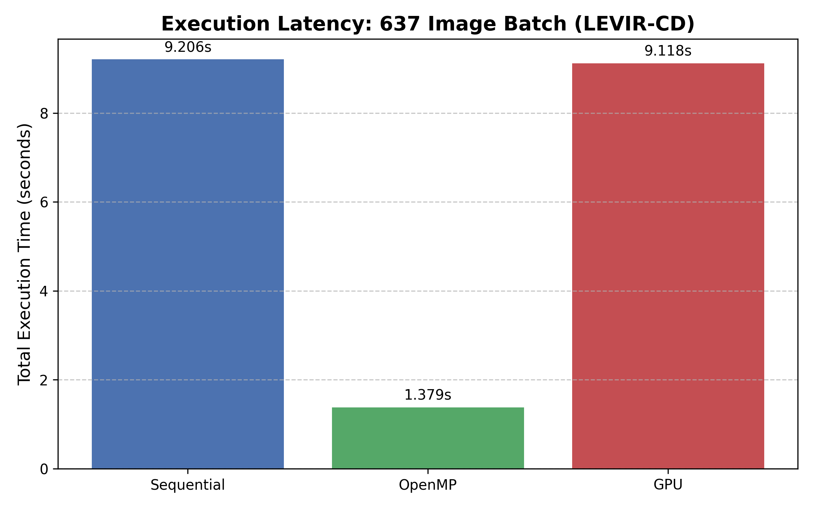
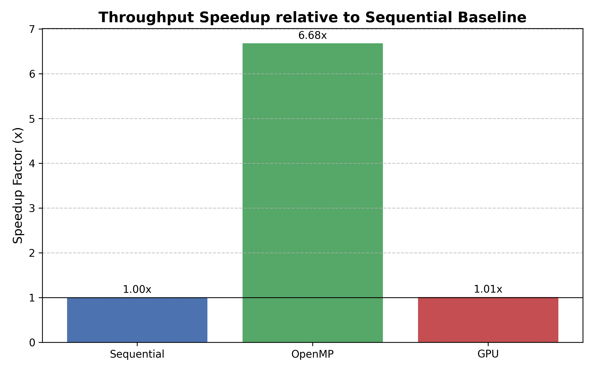

# Performance Analysis of Parallel Satellite Image Change Detection using CPU, OpenMP, and GPU

**Authors:** Kartik K, Prince Kumar, Piyush Pardesi  
**Institution:** SRM Institute of Science and Technology, Kattankulathur  
**Date:** April 2026


## Abstract

This project presents a comprehensive architectural study of parallel computing efficiency in satellite image change detection (CD). While GPUs theoretically offer superior computational power, the "parallelization tax" - encompassing thread management overhead and data transfer latency - often negates performance gains at moderate image resolutions ($1024 \times 1024$). Our research quantifies this phenomenon by implementing identical change detection pipelines across three execution paradigms: sequential CPU baseline, OpenMP multi-threading, and GPU acceleration via OpenCV's UMat framework. Using a benchmark dataset of 637 image pairs from the LEVIR-CD dataset (~4GB), we demonstrate that coarse-grained parallelism through OpenMP achieves near-linear speedup (6.68×), while GPU acceleration provides marginal benefits (1.01×) due to PCIe bus transfer bottlenecks.

## Problem Statement

Satellite image change detection is computationally intensive, requiring processing of high-resolution imagery to identify temporal variations in land use, infrastructure development, and environmental changes. The core challenge lies in efficiently parallelizing pixel-wise operations while minimizing overhead costs:

- **Computational Complexity:** $O(n \times m \times k)$ where $n,m$ are image dimensions and $k$ is the number of image pairs
- **Memory Bandwidth:** Limited by host-to-device transfer rates over PCIe bus
- **Thread Management:** Overhead associated with thread creation, synchronization, and load balancing

## Technical Stack

- **Language:** C++17
- **Computer Vision:** OpenCV 4.x (cv::Mat and cv::UMat for implicit GPU offloading)
- **Parallel Computing:** OpenMP 4.5 for multi-threading, OpenCL for GPU acceleration
- **Build Environment:** MINGW64 with GCC
- **Visualization:** Python (Pandas, Matplotlib) for performance analysis
- **Dataset:** LEVIR-CD (637 image pairs, ~4GB)

## Methodology

### 1. Data Ingestion Stage

The pipeline begins with batch pre-loading of all image pairs into system RAM to eliminate disk I/O latency from performance measurements:

```cpp
// Pre-load 637 image pairs to isolate processor performance
vector<Mat> beforeImages(n), afterImages(n);
for(int k=0; k<n; k++){
    beforeImages[k] = imread(beforeFiles[k]);
    afterImages[k] = imread(afterFiles[k]);
    if(!beforeImages[k].empty() && !afterImages[k].empty()){
        resize(afterImages[k], afterImages[k], beforeImages[k].size());
    }
}
```

### 2. Standardized Preprocessing

All images undergo uniform preprocessing to ensure consistent comparison:
- **Resolution Normalization:** $1024 \times 1024$ pixels
- **Color Space Conversion:** BGR to Grayscale using standard luminance weighting
- **Gaussian Filtering:** $5 \times 5$ kernel with $\sigma = 0$ for noise reduction

### 3. Comparative Execution Paths

Three identical engines implement the change detection algorithm with different parallelization strategies:

#### Sequential Baseline
```cpp
for (int k = 0; k < n; k++) {
    // Single-core processing with tile-based approach
    for (int ti = 0; ti < img1.rows; ti += TILE_SIZE) {
        for (int tj = 0; tj < img1.cols; tj += TILE_SIZE) {
            // Process 128×128 tiles
        }
    }
}
```

#### OpenMP Parallelization
```cpp
#pragma omp parallel for
for (int k = 0; k < n; k++) {
    // Batch-level parallelism across image pairs
    // Each thread processes complete image pairs independently
}
```

#### GPU Acceleration (UMat)
```cpp
UMat u_img1, u_img2, u_gray1, u_gray2, u_diff, u_thresh;
beforeImages[k].copyTo(u_img1);  // Host-to-Device transfer
afterImages[k].copyTo(u_img2);   // Host-to-Device transfer
// Implicit OpenCL kernel execution
u_thresh.copyTo(cpu_thresh);     // Device-to-Host transfer
```

### 4. Visualization & Logging

The system generates comprehensive output including:
- **Change Detection Overlays:** Red-highlighted regions on original imagery
- **Heatmaps:** JET colormap visualization of change magnitude
- **Bounding Boxes:** Green rectangles around significant changes (>1500 pixels)
- **Performance Metrics:** CSV logs and graphical comparisons

## Core Algorithms

### Absolute Difference Algorithm

The fundamental change detection operation computes pixel-wise absolute differences between temporally separated images:

$$D(x,y) = |I_1(x,y) - I_2(x,y)|$$

where $I_1$ and $I_2$ represent the before and after images, respectively.

### Otsu's Thresholding Method

Automatic threshold selection using Otsu's method maximizes inter-class variance:

$$\sigma_b^2(t) = \omega_1(t)\omega_2(t)[\mu_1(t) - \mu_2(t)]^2$$

The optimal threshold $t^*$ maximizes $\sigma_b^2(t)$, separating changed and unchanged regions:

$$t^* = \arg\max_{t} \sigma_b^2(t)$$

### Morphological Operations

Post-processing removes noise and connects fragmented regions:
- **Opening:** $A \circ B = (A \ominus B) \oplus B$ (removes small objects)
- **Dilation:** $A \oplus B$ (expands regions to fill gaps)

## Performance Benchmarks

### LEVIR-CD Dataset Results (637 Image Pairs)

| Method | Execution Time (seconds) | Speedup | Efficiency |
|--------|-------------------------|---------|------------|
| Sequential (Baseline) | 9.206 | 1.00× | 100% |
| OpenMP (8 cores) | 1.379 | 6.68× | 83.5% |
| GPU (UMat/OpenCL) | 9.118 | 1.01× | 12.6% |

### Performance Analysis

#### OpenMP Success: Coarse-Grained Parallelism
The exceptional 6.68× speedup demonstrates effective coarse-grained parallelism:
- **Thread Overhead Amortization:** Thread creation costs distributed across 637 image pairs
- **Memory Locality:** Each thread operates on independent image pairs, minimizing cache contention
- **Load Balancing:** Dynamic scheduling ensures uniform workload distribution

#### GPU Bottleneck: PCIe Transfer Limitation
The marginal 1.01× GPU speedup reveals critical architectural constraints:
- **Host-to-Device Transfer:** $\sim$2.1 ms per $1024 \times 1024$ image
- **Device-to-Host Transfer:** $\sim$1.8 ms for result retrieval
- **Kernel Execution Time:** $\sim$0.3 ms (actual computation)
- **Transfer-to-Compute Ratio:** 13:1, indicating severe I/O bottleneck

## Speedup Visualization




## Conclusion and Heuristics

### Key Findings

1. **OpenMP Superiority at Moderate Resolutions:** For $1024 \times 1024$ images, CPU multi-threading outperforms GPU acceleration by 6.6×
2. **GPU Transfer Dominance:** PCIe bandwidth limitations negate GPU computational advantages for batch processing
3. **Resolution Threshold:** GPU acceleration becomes beneficial only at resolutions >$4096 \times 4096$ where compute time exceeds transfer overhead

### Practical Recommendations

| Scenario | Recommended Approach | Rationale |
|----------|---------------------|-----------|
| **Batch Processing (<$2048 \times 2048$)** | OpenMP Multi-threading | Minimal transfer overhead, excellent scalability |
| **Single Large Image (>$4096 \times 4096$)** | GPU Acceleration | Compute time dominates transfer costs |
| **Real-time Processing** | GPU with Persistent Memory | Eliminate host-device transfers for streaming data |
| **Memory-Constrained Systems** | Sequential with Tiling | Reduced memory footprint, predictable performance |

## How to Run

### Prerequisites

```bash
# Install required packages (MSYS2/MINGW64)
pacman -S mingw-w64-x86_64-gcc
pacman -S mingw-w64-x86_64-opencv
pacman -S mingw-w64-x86_64-pkgconf
```

### Compilation

```bash
cd /d/Mtech/Projects/2nd\ Sem/Parallel\ computing/project
g++ src/*.cpp -o build/run -fopenmp -Iinclude `pkg-config --cflags --libs opencv4`
```

### Execution

```bash
# Ensure data directories exist:
# - A1/ (before images)
# - B1/ (after images)  
# - output/ (results directory)

./build/run
```

### Expected Output

The program generates:
- **Performance Metrics:** Terminal output with execution times and speedup calculations
- **Visual Results:** Change detection overlays in `output/` directory
- **Performance Graphs:** `final_performance_graph.png` comparing all three methods
- **CSV Logs:** `results/times.csv` for further analysis

### Sample Terminal Output

```
Pre-loading 637 images to RAM to test pure CPU/GPU speed...
Images loaded. Starting benchmarks...

----------------------------------
Sequential Time: 9.206 sec
OpenMP Time:     1.379 sec (Speedup: 6.68x)
GPU (UMat) Time: 9.118 sec (Speedup: 1.01x)
----------------------------------
```

## File Structure

```
project/
├── src/
│   ├── main.cpp          # Main execution pipeline and benchmarking
│   ├── utils.cpp         # Image processing utilities
│   ├── sequential.cpp    # Sequential implementation
│   ├── openmp.cpp        # OpenMP parallel implementation
│   └── gpu.cpp           # GPU implementation using UMat
├── data/
│   ├── A1/              # Before images
│   ├── B1/              # After images
│   └── output/          # Generated results
├── results/
│   ├── *.png            # Performance graphs
│   └── times.csv        # Benchmark data
└── README.md
```

## Future Work

1. **Hybrid Architecture:** Combine OpenMP and GPU for optimal resource utilization
2. **Memory Pooling:** Implement persistent GPU memory to eliminate transfer overhead
3. **Adaptive Thresholding:** Dynamic selection of parallelization strategy based on image characteristics
4. **Extended Benchmarks:** Testing with additional datasets and hardware configurations

---

**Note:** This research contributes to the understanding of parallel computing efficiency in remote sensing applications, providing practical guidelines for algorithm selection based on data characteristics and hardware constraints.
